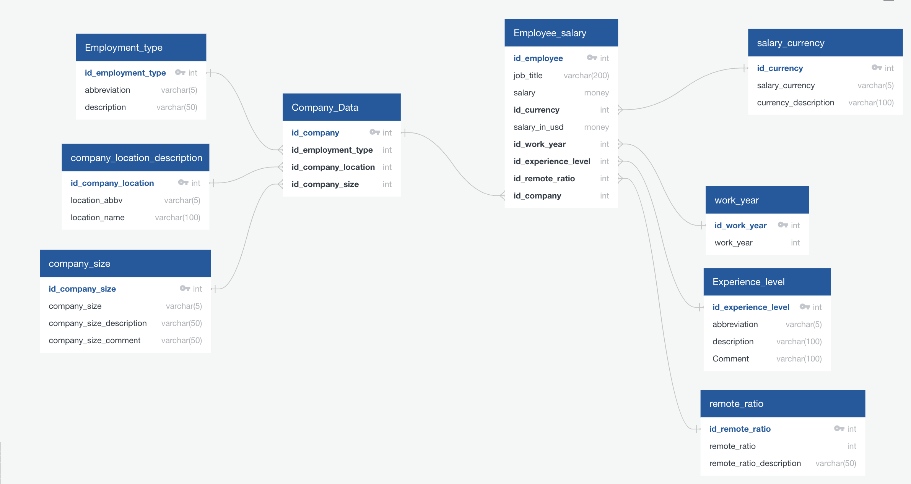

# Project3_T2_Data_Engineering
Project 3 related to Data Engineering 

# Requirements:
Data Engineering Track

For this track, your group will follow data engineering processes. Here are the specific requirements:

1. Data must be stored in a SQL or NoSQL database (PostgreSQL, MongoDB, SQLite, etc) and the database must include at least two tables (SQL) or collections (NoSQL).
     Define:  PGAdmin4
     Database: Data Salaries. found on https://www.kaggle.com/datasets/willianoliveiragibin/data-jobs-salaries/
   
2. The database must contain at least 100 records.
    ok
   
3. Your project must use ETL workflows to ingest data into the database (i.e. the data should not be exactly the same as the original source; it should have been transformed in some way).
    Download in CSV
    Work with ODBschema
    
4. Your project must include a method for reading data from the database and displaying it for future use, such as:
  Pandas DataFrame. - Selected, the results of the queries should be exported  and use the Pandas DataFrame
  Flask API with JSON output

     4.a. - Get the avg salary according the job title. SANTIAGO
   
     4.b. - Get the top 3 countries and review the minimum wage and max wage and compare them. SOFIA
   
     4.c. - Show the avg wage of the top 3. SANTIAGO
   
     4.d. - Show the % of the remote ratio through the years. ANA BRISA
   
     4.e. - Using leaflet show in a map how the countries avg salaries are and by layers show the job title. SOFIA
   
     4.f. - Get the size of the company and how many employees are. ANA BRISA

6. Your project must use one additional library not covered in class related to data engineering. Consider libraries for data streaming, cloud, data pipelines, or data validation.
   01/15 - research additional libraries using python.
   
7. Your GitHub repo must include a README.md with an outline of the project including:
An overview of the project and its purpose
    

Instructions on how to use and interact with the project

Documentation of the database used and why (e.g. benefits of SQL or NoSQL for this project)
    https://www.kaggle.com/datasets/willianoliveiragibin/data-jobs-salaries/
    

ETL workflow with diagrams or ERD
  

At least one paragraph summarizing efforts for ethical considerations made in the project

References for the data source(s)
    Data Jobs Salaries database found in https://www.kaggle.com/datasets/willianoliveiragibin/data-jobs-salaries/
    
  
References for any code used that is not your own

OPTIONAL: add user-driven interaction, either before or after the ETL process. e.g.:

BEFORE: provide a menu of options for the user to narrow the range of data being extracted from a data source (e.g. API or CSV file, where fields are known in advance).
    
    
AFTER: Once the data is stored in the database, add user capability to extract filtered data from the database prior to loading it in a Pandas DataFrame or a JSON output from a Flask API.

OVERVIEW OF THE PROYECT AND ITS PURPOSE

- Como la tecnologia ha aumentado en los años.
- Estamos comparando salarios y el impacto que se tienen estos trabajos y como han aumentado.
- Queremos enseñar como paises 1er munidstas nos llevan mucha ventaja a los 3er mundistas en tema de salarios.
- La necesidad que existe en las empresas por tener un Data Engineer , data scientist, Data Analyst, Data Architect, ML Engineer.
- Enseñar cuantas PYMES tienen empleados en el entorno de la Data 

  

